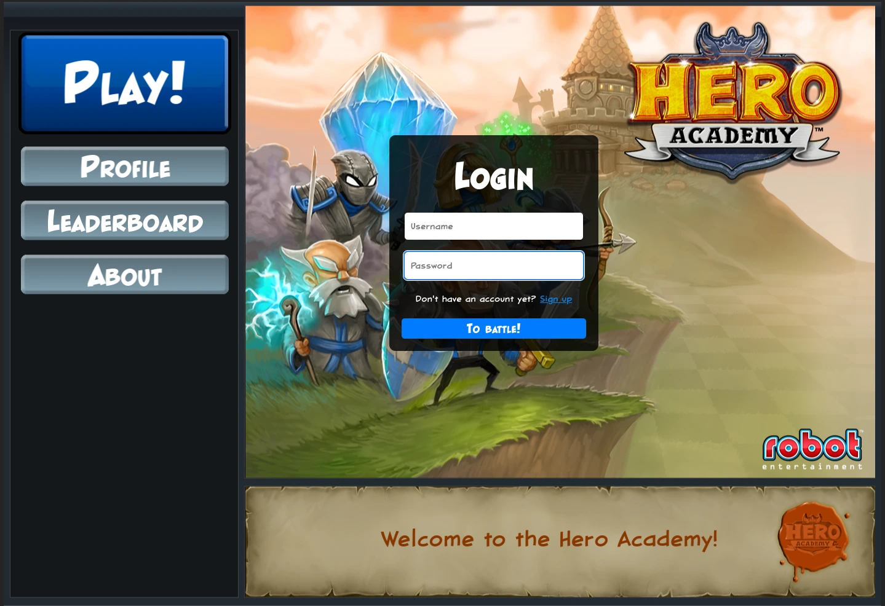

# Fan Academy

Fan Academy is a fan-made revival of the game **Hero Academy**, a turn-based tactics game developed by Robot Entertainment. This project aims to bring back the joy of the original game, offering a way for fans to rediscover it.

This is not a reverse engineering of the game. The game logic is being implemented from scratch while using the original assets to try to preserve the game's aesthetic as much as possible.

## What is Hero Academy?

Hero Academy is a player-versus-player turn-based tactics game where players choose a team of heroes and use their units and items to defeat their opponents. Unfortunately, the game is currently deadf, delisted from all stores and its online servers shut down. It is no longer possible for people who purchased the game to play it.

Learn more about the original game [here on its Wikipedia page](https://en.wikipedia.org/wiki/Hero_Academy).

## How was Fan Academy made?

Fan Academy is written in Typescript, using the game engine [Phaser](https://phaser.io/) for the client and Node, Express,. MongoDB and [Colyseus](https://colyseus.io/) for the back-end.

The server code is hosted on a [separate repository](https://github.com/Dan-DH/fan-academy-be).

## Who is behind the project?

Hi, I'm **Daniel, a.k.a. dadazbk**, a full-stack developer based in Belgium. You can learn more about me on my [GitHub profile](https://github.com/Dan-DH).

## Licensing and disclaimer

The code in this repository is licensed under the [Creative Commons Attribution-NonCommercial 4.0 International (CC BY-NC 4.0)](https://creativecommons.org/licenses/by-nc/4.0/) license.

This means:
- **You are free to:**
  - Share: Copy and redistribute the code in any medium or format.
  - Adapt: Remix, transform, and build upon the code.

- **Under the following terms:**
  - **Attribution:** You must give appropriate credit, provide a link to the license, and indicate if changes were made. You may do so in any reasonable manner, but not in any way that suggests the licensor endorses you or your use.
  - **NonCommercial:** You may not use the material for commercial purposes.

### **Disclaimer for Third-Party Assets**

This project includes proprietary assets from **Hero Academy**, which are the property of **Robot Entertainment**. These assets are used for educational and non-commercial purposes under the assumption of fair use for a fan project. **This license applies only to the code in this repository and not to the assets.** All rights to the proprietary assets remain with their respective owners.
